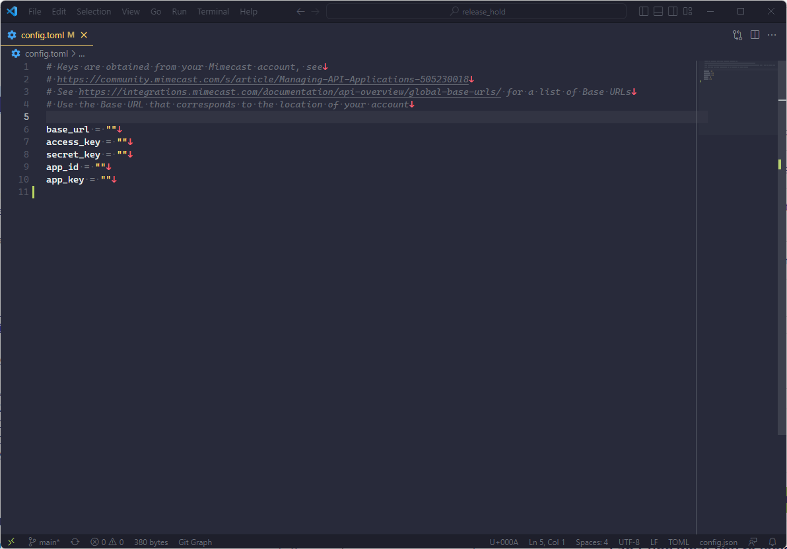

# Installation
Ensure that Python 3.9 or higher is installed on the system that will be runnung the script. To install the requirements under Windows, run:
```
PS> C:\> python.exe -m pip -r requirements.txt
```

For macOS/Libux/*BSD:
```
$ python3 -m pip -r requirements.txt
```

# Configuration
## Obtaining the API Keys
Please refer to: [Mimecast's Knowledge Base article on Managing API Applications](https://community.mimecast.com/s/article/Managing-API-Applications-505230018)
## Edit _config.toml_
Once you have the application keys, open the _config.toml_ file in a text editor, placing the keys between the empty quotes and save the file.



Depending on where your account is located geographically, the `base_url` variable should be one of the following:


|REGION|HOST|
| :--- | :--- |
|EU|https://eu-api.mimecast.com|
|DE|https://de-api.mimecast.com|
|US|https://us-api.mimecast.com|
|USB|https://usb-api.mimecast.com|
|USPCOM|https://uspcom-api.mimecast-pscom-us.com|
|CA|https://ca-api.mimecast.com|
|ZA|https://za-api.mimecast.com|
|AU|https://au-api.mimecast.com|
|Offshore|https://je-api.mimecast.com|

## Running the Script
The script is designed to be run *hourly*, and will release messages from the previous hour that the script was run. The file can be saved anywhere on the network, so long as the sheduler has access to it. It is also important that the `hold_release.py` file and `config.toml` file are in the same location.

Depending on the platform that you are using, you need to set up a task or job to regularly run the file. Please see below for instructions for each platform.

- Linux crontab: https://linuxconfig.org/using-cron-scheduler-on-linux-systems
- Linux systemd: https://linuxconfig.org/how-to-schedule-tasks-with-systemd-timers-in-linux
- Windows Task Scheduler: https://www.askpython.com/python/examples/execute-python-windows-task-scheduler
